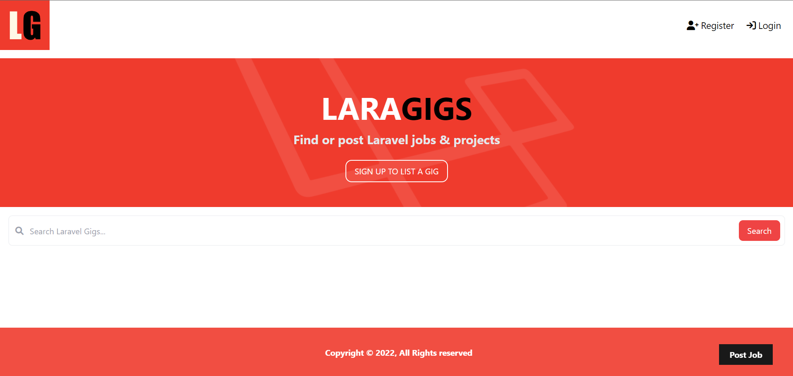
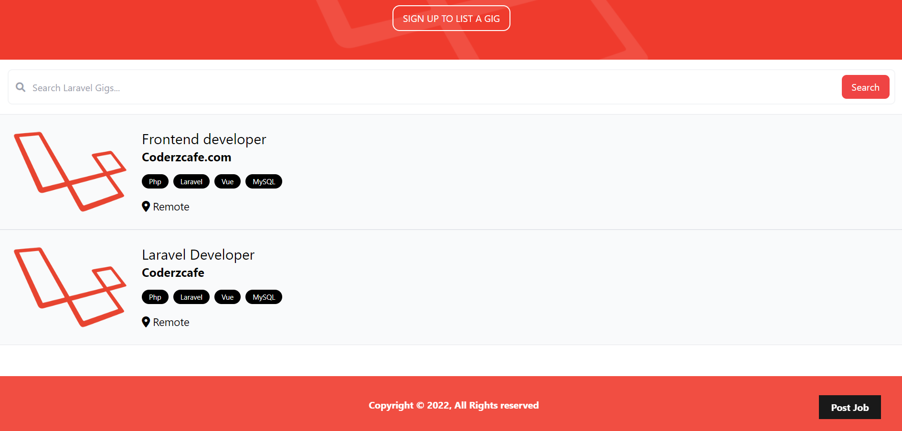
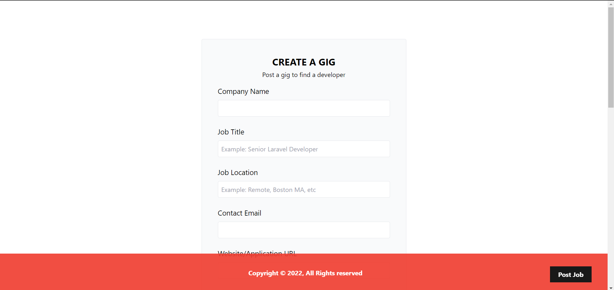

## LaraGigs
This is a simple application is built upon the Laravel framework, utilizing its backend functionalities. The frontend aspect of the application is developed using Laravel Blade templating engine and for storing data uses MySQL database.

#### How to run this project:
0. Open your command prompt or shell
1. ```git clone https://github.com/sudiptoshahin/laragigs_job.git```
2. Create a database in mysql database named ```laravel_laragigs```
3. Run ```php artisan migrate```
4. Then run project locally with ```php artisan serve```

#### Some screenshots
1. 
2. 
3. 